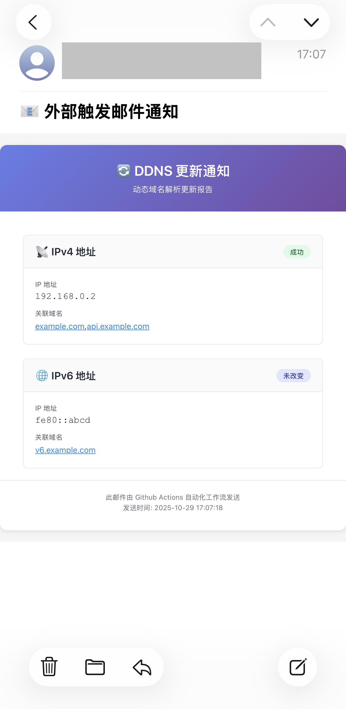

## send-mail

通过 HTTP 请求触发 Github Actions 自动发送邮件的 workflow。

### 如何使用

- fork 本仓库到你的 Github 账号下。
- 在你的仓库中，进入 `Settings` -> `Secrets and variables` -> `Actions`，添加以下 Secrets：
    - `MAIL_USERNAME`：SMTP 服务器用户名（通常是你的邮箱地址）
    - `MAIL_PASSWORD`：SMTP 服务器密码（通常是授权码）

      | 名称          | 值                                      | 必填 |
      | ------------- | --------------------------------------- | ---- |
      | MAIL_USERNAME | SMTP 服务器用户名（通常是你的邮箱地址） | 是   |
      | MAIL_PASSWORD | SMTP 服务器密码（通常是授权码）         | 是   |

- 发送http请求触发邮件发送
    - 请求格式如下：
      ```bash
      curl --request POST \
       --url https://api.github.com/repos/<owner>/<repo>/dispatches \
       --header 'Accept: application/vnd.github+json' \
       --header 'Authorization: <YOUR_GITHUB_TOKEN>' \
       --header 'Content-Type: application/json' \
       --data '{
                 "event_type": "send_mail",
                 "client_payload": {
                     "to": "example@163.com",
                     "subject": "📧 外部触发邮件通知",
                     "template": "ip_update_template.html",
                     "variables": {
                       "xx": "xx",
                       "ipv4Result": "成功",
                       "ipv4Domains": "example.com,api.example.com",
                       "ipv6Addr": "fe80::abcd",
                       "ipv6Result": "未改变",
                       "ipv6Domains": "v6.example.com",
                       "message": "来自Webhook的提醒111"
                     }
                 }
               }'
      ```
      其中：
        - `<owner>`：你的 Github 用户名或组织名
        - `<repo>`：你的仓库名
        - `<YOUR_GITHUB_TOKEN>`：你的 Github 个人访问令牌（需要有 `repo` 权限）

      | 变量名                  | 说明                     |
      |----------------------| ------------------------ |
      | \<owner>             | 你的 Github 用户名或组织名                |
      | \<repo>              | 你的仓库名                 |
      | \<YOUR_GITHUB_TOKEN> | 你的 Github 个人访问令牌（需要有 `repo` 权限） |

    - 示例请求：
      ```bash
      curl --request POST \
      --url https://api.github.com/repos/vains-Sofia/send-mail/dispatches \
      --header 'Accept: application/vnd.github+json' \
      --header 'Authorization: <YOUR_GITHUB_TOKEN>' \
      --header 'Content-Type: application/json' \
      --data '{
                "event_type": "send_mail",
                "client_payload": {
                  "to": "example@163.com",
                  "subject": "📧 外部触发邮件通知",
                  "template": "ip_update_template.html",
                  "variables": {
                    "ipv4Addr": "192.168.0.2",
                    "ipv4Result": "成功",
                    "ipv4Domains": "example.com,api.example.com",
                    "ipv6Addr": "fe80::abcd",
                    "ipv6Result": "未改变",
                    "ipv6Domains": "v6.example.com",
                    "message": "来自Webhook的提醒111"
                    }
                  }
              }'
      ```
    - 入参说明：
        - `to`：收件人邮箱地址
        - `subject`：邮件主题
        - `template`：邮件模板文件名（需预先在仓库中准备好对应的 HTML 模板文件，位于 mail-templates/ 目录下）
        - `variables`：模板变量的键值对，根据模板中的占位符进行替换

          | 变量名 | 说明                     |
          |-----| ------------------------ |
          | to  | 收件人邮箱地址                |
          | subject | 邮件主题                 |
          | template | 邮件模板文件名（位于 mail-templates/ 目录下） |
          | variables | 模板变量的键值对，根据模板中的占位符进行替

### 邮件模板示例

- 仓库中的 `mail-templates/ip_update_template.html`，点击[查看模板内容](mail-templates/ip_update_template.html)

### 模板示例效果

  

### 注意事项
- 确保用户名和密码（授权码）有效。
- 确保你的 Github 个人访问令牌具有足够的权限来触发仓库的 `repository_dispatch` 事件。
- 邮件模板文件需预先在仓库中准备好，位于 `mail-templates/` 目录下。
